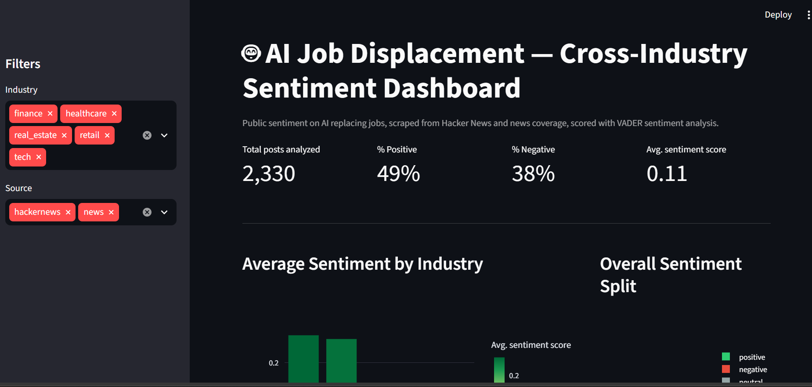
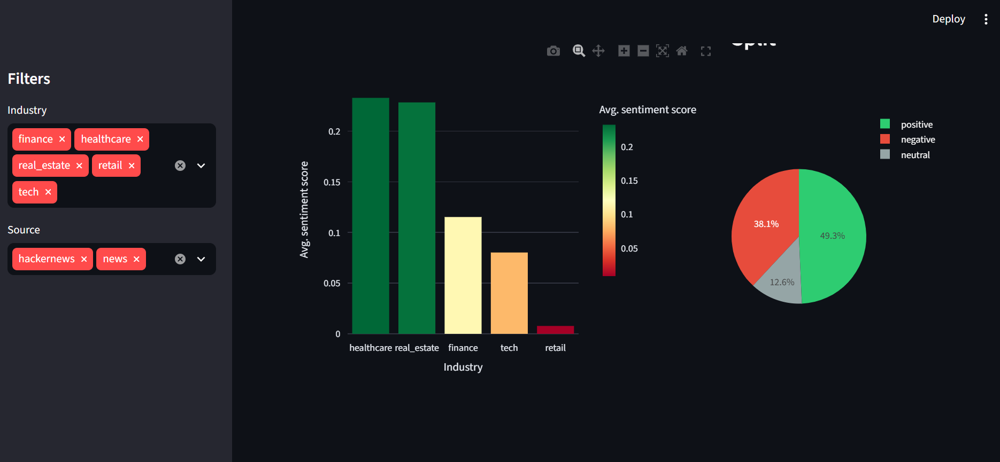
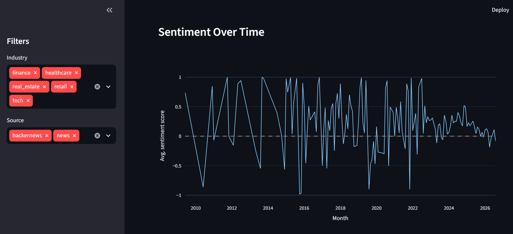
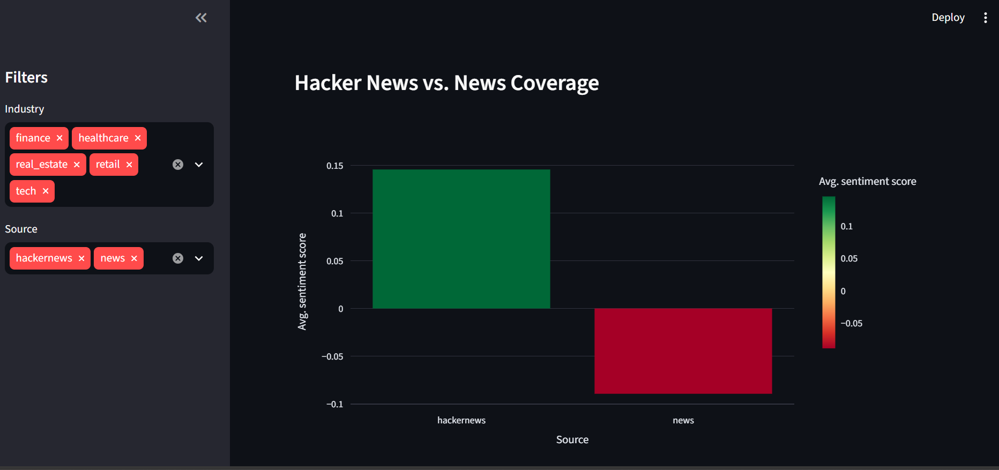
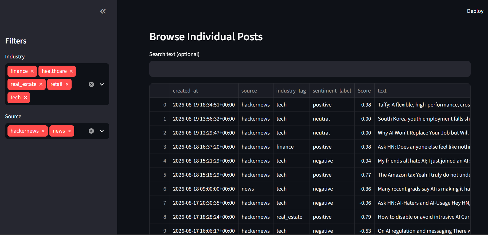

# AI Job Displacement — Cross-Industry Sentiment Dashboard

## Problem
Is the public panicking about AI taking jobs — or has the conversation moved past that? And does it differ by industry (tech vs healthcare vs real estate vs finance vs retail)?

This project scrapes public discussion from Hacker News and Google News, runs sentiment analysis on it, and visualizes how sentiment on "AI replacing jobs" trends over time and differs across industries and sources.

## Key Findings
- Overall sentiment is genuinely mixed: **49% positive, 38% negative, 13% neutral**
- **Healthcare and real estate** lean most positive — AI is framed as "helping," not "replacing"
- **Retail** leans most negative/neutral — AI is framed as directly replacing customer-facing jobs
- **Hacker News (tech insiders) is more optimistic (avg. 0.15) than mainstream news coverage (avg. -0.09)**

## Screenshots

**Overview — headline stats and filters**


**Sentiment by industry + overall split**


**Sentiment over time (2010–2026)**


**Hacker News vs. mainstream news coverage**


**Browsable table of individual posts**


## Data Sources
- **Hacker News** — via the free Algolia HN Search API, no auth required. Searched 5 phrases around AI job displacement, pulling both stories and comments.
- **Google News RSS** — free, no-auth news search, queried separately per industry so articles arrive pre-tagged by topic.

## Pipeline
```
scrape_hackernews.py  ─┐
                        ├─→ preprocess.py ─→ sentiment_analysis.py ─→ dashboard/app.py
scrape_news.py         ─┘
```
1. **Scrape** — pull raw posts/articles from both sources into `data/raw/`
2. **Preprocess** — strip HTML junk, filter irrelevant/duplicate rows, and re-tag Hacker News posts by actual industry content (instead of defaulting everything to "tech")
3. **Sentiment scoring** — VADER scores every row from -1 (very negative) to +1 (very positive)
4. **Dashboard** — an interactive Streamlit app with filters, charts, and a searchable post table

## Tech Stack
- Python (requests, pandas)
- VADER for sentiment scoring
- Streamlit + Plotly for the interactive dashboard

## Project Structure
```
ai-sentiment-dashboard/
├── data/
│   ├── raw/          # raw scraped data per source
│   └── processed/    # cleaned + sentiment-scored data
├── scripts/          # scraping, cleaning, and sentiment scripts
├── dashboard/         # Streamlit app
└── PROJECT_WALKTHROUGH.md   # full plain-language write-up + FAQ
```

## How to Run
```bash
pip install -r requirements.txt
python scripts/scrape_hackernews.py
python scripts/scrape_news.py
python scripts/preprocess.py
python scripts/sentiment_analysis.py
streamlit run dashboard/app.py
```

## Status
- [x] Project scaffolding
- [x] Hacker News scraper
- [x] News article scraper
- [x] Data cleaning + merge + industry re-tagging
- [x] Sentiment scoring
- [x] Streamlit dashboard
- [ ] Deploy to a public, shareable link

## Honest Limitations
- VADER is a lexicon-based tool — it can miss sarcasm or deeper nuance a full ML model might catch
- Hacker News is inherently tech-skewed, so "tech" remains the largest category even after re-tagging by content
- Some noise remains in the data (e.g. occasional off-topic posts matched by search keywords) — expected with real-world scraped data
- The dashboard is a snapshot, not a live-updating feed — it reflects data as of the last scrape

See `PROJECT_WALKTHROUGH.md` for the full step-by-step write-up, including the reasoning behind each design decision.

## Author
Favour Elemi — [LinkedIn](https://www.linkedin.com/in/favour-elemi-42b7b236a)
